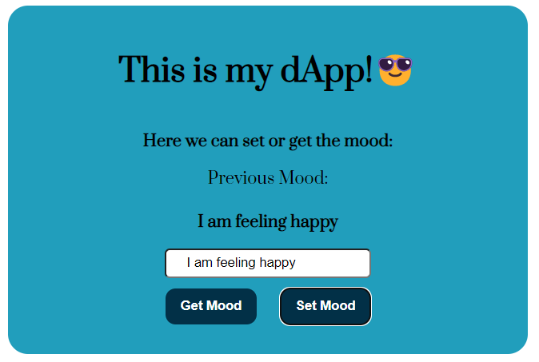

# My Ethereum First Dapp
Dapp link: 
The deployed contract's address: 
``` 0x1C7cEF23918Cd492B1A4Ad6A713F50b8fcECb5eB ```
## Requirements:
- Knowledge of Metamask (how to use it)
- npm usage
- Frontend Skills
- Solidity Skills (Writing smart contracts)
- Ether.js Skills

## Procdure Followed:
- Create a basic HTML web page
- Create a basic Solidity smart contract in Remix
- Connect the web page with the smart contracts using Ethers.js.

## Preview After Completion:


## Code
### Smart Contract:
Link: [Open HTML files in Editor](mood.sol)
OR
Quick Check here :point_down:
```
// SPDX-License-Identifier: MIT
 pragma solidity ^0.8.1;


contract MoodDiary{

 
    string mood;
  
    //create a function that writes a mood to the smart contract
    function SetmyMood(string memory _mood) public{
        mood = _mood;
    }

    //create a function the reads the mood from the smart contract
    function GetmyMood() public view returns(string memory){
        return mood;
    }
}
```
### HTML 
Link: [Open HTML files in Editor](index.html)
OR
Quick Check here :point_down:
```
<!DOCTYPE html>
<html lang="en">
<head>
    <meta charset="UTF-8">
    <meta http-equiv="X-UA-Compatible" content="IE=edge">
    <meta name="viewport" content="width=device-width, initial-scale=1.0">
    <link rel="preconnect" href="https://fonts.googleapis.com">
<link rel="preconnect" href="https://fonts.gstatic.com" crossorigin>
<link href="https://fonts.googleapis.com/css2?family=Prata&display=swap" rel="stylesheet">
    <link rel="stylesheet" href="style.css">
    <title>First Ethereum Dapp</title>
</head>
<body>
    <div class="first-div">
        <h1>This is my dApp!😎</h1>
        <p>Here we can set or get the mood:</p>
        <label for="mood" >Previous Mood:</label> <br />
        <p id="current-mood">Non</p>
        <input type="text" id="mood" />
        <div class="btns-div">
            <button onclick="GetmyMood()">Get Mood</button>
            <button onclick="SetmyMood()">Set Mood</button>    
        </div>
              
      </div>


      <script src="https://cdn.ethers.io/lib/ethers-5.2.umd.min.js" type="application/javascript">
        </script>

        <script>
            const provider = new ethers.providers.Web3Provider(
      window.ethereum,
      "ropsten"
    );
        // ABI Code from Smart Contract:
        const MoodContractAddress = "0x1C7cEF23918Cd492B1A4Ad6A713F50b8fcECb5eB";
        const MoodContractABI = [
            {
                "inputs": [],
                "name": "GetmyMood",
                "outputs": [
                    {
                        "internalType": "string",
                        "name": "",
                        "type": "string"
                    }
                ],
                "stateMutability": "view",
                "type": "function"
            },
            {
                "inputs": 
                        [
                            {
                                "internalType": "string",
                                "name": "_mood",
                                "type": "string"
                            }
                        ],

                "name": "SetmyMood",
                "outputs": [],
                "stateMutability": "nonpayable",
                "type": "function"
            }
        ]

        
    let MoodContract;
    let signer;

    provider.send("eth_requestAccounts", []).then(() => {
      provider.listAccounts().then(function (accounts) {
        signer = provider.getSigner(accounts[0]);
        MoodContract = new ethers.Contract(
          MoodContractAddress,
          MoodContractABI,
          signer
        );
      });
    });

    async function GetmyMood() {
      const getMoodPromise = MoodContract.GetmyMood();
      const Mood = await getMoodPromise;
      console.log(Mood);
    }

    async function SetmyMood() {
      const mood = document.getElementById("mood").value;
      const setMoodPromise = MoodContract.SetmyMood(mood);
      await setMoodPromise;
      document.getElementById("current-mood").textContent=mood;
      console.log(mood);
    }

        </script>
</body>
</html>
```

